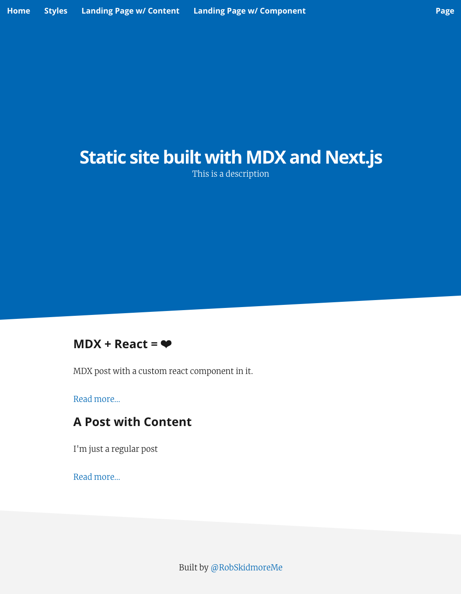

import { Head, Appear } from 'mdx-deck'
import { Split } from 'mdx-deck/layouts'
import {Radar} from 'react-chartjs-2';

export { swiss as theme } from './theme'

<Head>
  <title>
    Building a Static Site Generator with MDX and Next.js
  </title>
</Head>

# Building a Static Site Generator with Next.js and MDX
### Code - [rskd.me/next-mdx](https://rskd.me/next-mdx)
### Slides - [rskd.me/next-mdx-slides](https://rskd.me/next-mdx-slides)

```notes
Who has heard of MDX? Next?
```

---

## Who am I?
- [@RobSkidmoreMe](https://twitter.com/RobSkidmoreMe)
- Spoke in Feb on Redux and Mobx
- Software Engineer @ [Grow.com](https://grow.com)
- We do BI for SMBs

---

## What is [MDX](https://mdxjs.com/)?
"MDX is a format that lets you seamlessly use JSX in your Markdown documents." - MDX Docs

---

## What is [Next.js](https://nextjs.org/)?
Similar to create-react-app
- Code splitting
- Universal rendering
- Hot reloading
- Routing

---

## Next + MDX = ❤
- Code = Content
- Flexibility
- Static site export in a few lines of code

---

## What does it look like?
<a href="https://nextjs-mdx-static-site.netlify.com/" target="_blank"></a>

```notes
First show the finished product

Content Types (Landing Page, Post)
Styling
Typography
```

---

## What does the code look like?
- [posts](https://github.com/robskidmore/nextjs-mdx-static-site/tree/master/posts) & [landingPages](https://github.com/robskidmore/nextjs-mdx-static-site/tree/master/landingPages) - Directories that holds the .mdx files
- [pages/posts.js](https://github.com/robskidmore/nextjs-mdx-static-site/blob/master/pages/posts.js) & [pages/landingPages.js](https://github.com/robskidmore/nextjs-mdx-static-site/blob/master/pages/landingPages.js) - Templates that render the posts
- [exportPosts.js](https://github.com/robskidmore/nextjs-mdx-static-site/blob/master/utils/exportPosts.js) - Builds the posts index
- [next.config.js](https://github.com/robskidmore/nextjs-mdx-static-site/blob/master/next.config.js) - Sets up exportPath for static export

```notes
templates
exportPosts.js
next.config.js
```

---

## More
- Questions: [@RobSkidmoreMe](https://twitter.com/RobSkidmoreMe)
- Code: [rskd.me/next-mdx](https://rskd.me/next-mdx)
- Slides: [rskd.me/next-mdx-slides](https://rskd.me/next-mdx-slides)
- [mdx-deck](https://github.com/jxnblk/mdx-deck)
